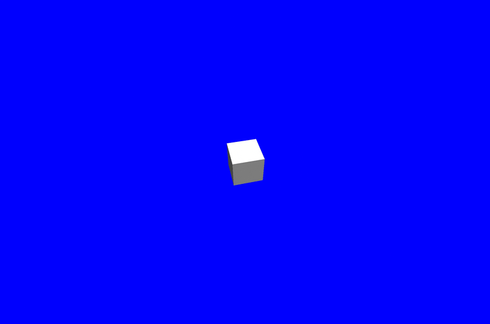

# ccapture.js examples
example scripts for rendering video animations in javascript ([three.js](https://threejs.org/) / [p5.js](https://p5js.org/) / [tween.js](http://tweenjs.github.io/tween.js/)) using [CCapture.js](https://github.com/spite/ccapture.js)

click the "record" button in each script to export WebM format video right in your web browser.

the `media/` folder contains scripts for converting to mp4 & gif using [`ffmpeg`](https://ffmpeg.org/download.html) & [`gifski`](https://gif.ski/) (these are bash executables, so run `chmod +x media/*.sh` first)

## [CCapture.js + three.js](./example_three.html)

## [CCapture.js + three.js + tween.js](./example_three_tween.html)

## [CCapture.js + p5.js](./example_p5.html)

